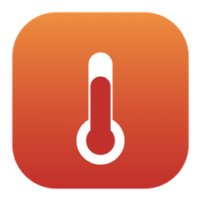
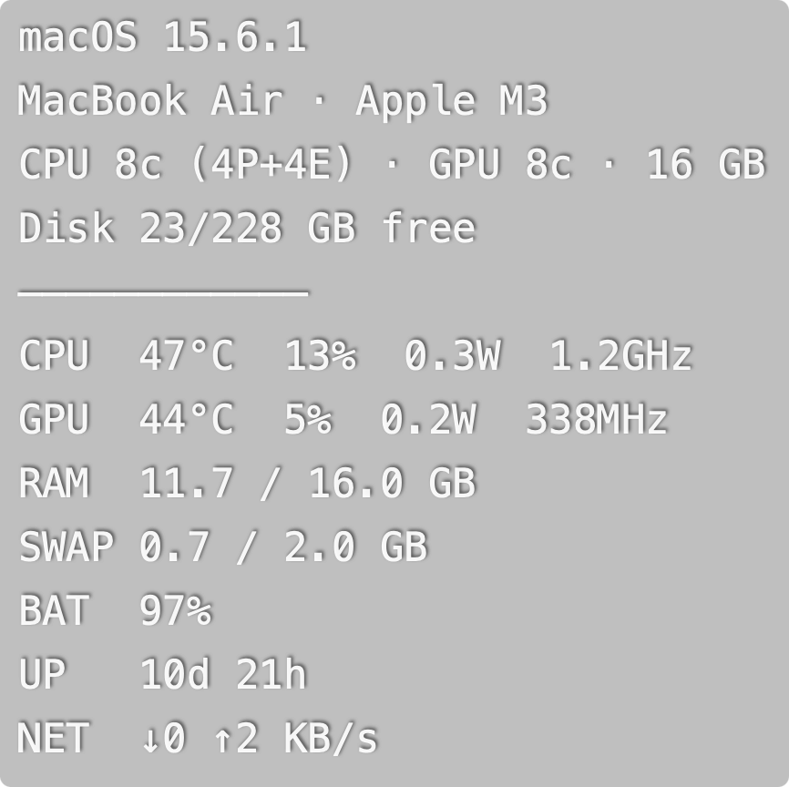

<div align="center">



# wptemps

**Les températures et les infos matériel de ton Mac, en surimpression sur le bureau.**

Une petite app **barre de menus** discrète — pas de fenêtre, pas d'icône Dock,
et **ton fond d'écran n'est jamais modifié**.




</div>

## ✨ Ce que ça affiche

- 🌡️ **Températures** CPU et GPU
- 📊 **Charge** CPU, **RAM**, **batterie**
- ⚡ **Conso en watts** (CPU / GPU)
- 🚀 **Détails** : % GPU + fréquences CPU/GPU
- 💾 **Swap**, ⏱️ **uptime**, 🌐 **débit réseau ↓/↑**
- 🖥️ **En-tête machine** : OS, modèle, puce, cœurs, RAM, disque

Chaque section est **activable/désactivable** depuis le menu, et tout est **mémorisé**.

## 📦 Installation

> **Apple Silicon uniquement** (M1/M2/M3/M4).

**Option A — Homebrew**
```bash
brew tap C0DK77/tap
brew trust c0dk77/tap
brew install --cask wptemps --no-quarantine
```

**Option B — Téléchargement**
Récupère `wptemps-x.y.z.dmg` dans les [Releases](https://github.com/C0DK77/wptemps/releases),
glisse `wptemps.app` dans Applications, puis **clic-droit → Ouvrir** au 1er lancement.

> L'app n'est pas signée par un compte développeur Apple : d'où le `--no-quarantine`
> (ou le clic-droit → Ouvrir) au tout premier lancement.

## 🎛️ Utilisation

Une icône 🌡 apparaît dans la **barre de menus** (en haut à droite). Clique-la :

- **Afficher les températures** — montre / masque l'overlay
- **Déverrouiller pour déplacer** — glisse l'overlay où tu veux, puis reverrouille
- **Affichage ▸** — choisis les infos (machine, watts, détails, swap, uptime, réseau, batterie)
- **Apparence ▸** — police, taille, gras/italique, couleur, alignement
- **Lancer au démarrage** · **Quitter**

La position et tous les réglages sont sauvegardés dans
`~/Library/Application Support/wptemps/settings.json`.

## 🔒 Sous le capot

- **Ne touche jamais au fond d'écran** : l'overlay est une fenêtre transparente
  épinglée au niveau du bureau (derrière tes icônes et fenêtres).
- **Sans `sudo`** : les capteurs sont lus via [`macmon`](https://github.com/vladkens/macmon)
  (embarqué dans l'app), en flux continu pour un coût CPU minime.
- **100 % local** : aucune donnée n'est envoyée nulle part.

## 🛠️ Construire depuis les sources

```bash
/usr/bin/python3 -m venv .venv
.venv/bin/pip install -r requirements.txt
.venv/bin/python -m wptemps.app     # lancer depuis les sources
bash scripts/make-dmg.sh 1.0.0      # construire le .app et le .dmg
.venv/bin/pytest -q                 # tests
```

La distribution (Release + Homebrew) est décrite dans [DISTRIBUTION.md](DISTRIBUTION.md).

## 📄 Licence & crédits

Code sous licence [MIT](LICENSE). Embarque [`macmon`](https://github.com/vladkens/macmon)
(MIT) — voir [THIRD_PARTY_NOTICES.md](THIRD_PARTY_NOTICES.md).
